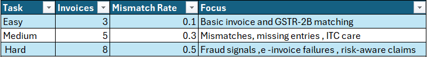
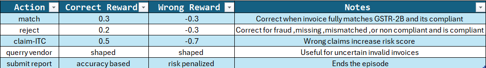

# GST-Recon-Env

GST-Recon-Env is an OpenEnv benchmark for Indian GST invoice reconciliation. Agents review purchase invoices against GSTR-2B entries, identify mismatches and fraud signals, claim eligible Input Tax Credit (ITC), and submit a final compliance report.

The environment is built for reinforcement learning evaluation: rewards are state-driven, task graders are deterministic, and repetitive single-action strategies are penalized.

## Motivation

GST reconciliation is a real compliance workflow for Indian businesses. Incorrect matching, invalid GSTINs, missing GSTR-2B entries, and wrong ITC claims can create audit risk and financial penalties. GST-Recon-Env turns this workflow into a compact RL benchmark with realistic compliance tradeoffs.

## Task Difficulty



| Task | Invoices | Mismatch Probability | Focus |
|------|----------|----------------------|-------|
| easy | 3 | 0.10 | Basic invoice and GSTR-2B matching |
| medium | 5 | 0.30 | Mismatches, missing entries, ITC care |
| hard | 8 | 0.50 | Fraud signals, e-invoice failures, risk-aware claims |

## Action Space



| Action | Correct Reward | Wrong Reward | Notes |
|--------|----------------|--------------|-------|
| `match` | `+0.3` | `-0.3` | Correct when the current invoice fully matches GSTR-2B and is compliant |
| `reject` | `+0.2` | `-0.3` | Correct for missing, mismatched, fraudulent, or non-compliant invoices |
| `claim_itc` | `+0.5` | `-0.7` | Wrong claims increase `risk_score` |
| `query_vendor` | shaped | shaped | Useful for uncertain invalid invoices |
| `submit_report` | accuracy based | risk penalized | Ends the episode and triggers final grading |

The reward logic ignores the submitted `invoice_id` for correctness and always evaluates the current state invoice.

## Observation Space

Each observation contains:

- `current_invoice`
- `available_gstr2b`
- `matched`
- `mismatches`
- `current_itc`
- `total_itc_possible`
- `progress`
- `warnings`
- `step_count`

HTTP step responses also include structured metadata:

```json
{
  "info": {
    "score": 0.0,
    "risk": 0.0,
    "processed": 1
  }
}
```

## Reward Design

Additional shaping prevents trivial exploitation:

- Duplicate invoice/action penalty: `-0.3`
- Repeated same decision penalty: `-0.1`
- Loop beyond invoice set penalty: `-0.2`
- Wrong ITC claims increase risk and reduce hard-mode score

## Grader Logic

Scores are deterministic and normalized to `[0.0, 1.0]`:

```python
def grade_easy(state):
    return state.correct_matches / len(state.invoices)

def grade_medium(state):
    penalty = state.wrong_itc_claims * 0.2
    return max(0.0, (state.correct_matches / len(state.invoices)) - penalty)

def grade_hard(state):
    risk_penalty = state.risk_score
    return max(0.0, (state.correct_matches / len(state.invoices)) * (1 - risk_penalty))
```

## Baseline Results

Recent local run:

```text
[END] success=True steps=8 score=~0.86 rewards=0.20,0.20,0.10,0.30,0.20,0.20,0.10,0.30
```

Reject-only strategies are penalized and are not competitive.

## Setup

```powershell
uv sync
```

Validate OpenEnv readiness:

```powershell
.\.venv\Scripts\openenv.exe validate
```

Expected:

```text
[OK] gst_recon: Ready for multi-mode deployment
```

## Run Instructions

Local inference, with automatic local-environment fallback if no server is running:

```powershell
.\.venv\Scripts\python.exe inference.py
```

Server mode:

```powershell
.\.venv\Scripts\python.exe -m server.app
```

Health check:

```powershell
curl http://localhost:8000/
```

Tasks endpoint:

```powershell
curl http://localhost:8000/tasks
```

Interactive API docs:

```powershell
http://localhost:8000/docs
```

## First Docker Run Notes

If you open `http://localhost:8000/` in a browser, you will see JSON such as:

```json
{"status":"ok"}
```

That is expected. This project exposes an API server, not a traditional frontend web page.

Useful beginner checks:

```powershell
docker ps
curl.exe http://localhost:8000/
curl.exe http://localhost:8000/tasks
curl.exe http://localhost:8000/state
```

To reset the environment with an actual task, send a JSON body:

```powershell
curl.exe -X POST http://localhost:8000/reset `
  -H "Content-Type: application/json" `
  -d "{\"task\":\"easy\"}"
```

Available task names are `easy`, `medium`, and `hard`.

If `POST /reset` is called without a JSON body, the server still returns HTTP 200 with a safe empty observation. That behavior is intentional for compatibility with simple health checks.

## Deployment Instructions

Docker build:

```powershell
docker build -t gst-recon-env .
```

Docker run:

```powershell
docker run --rm -p 8000:8000 gst-recon-env
```

Detached mode:

```powershell
docker run -d --name gst-recon-env-test -p 8000:8000 gst-recon-env
```

View container logs:

```powershell
docker logs gst-recon-env-test
```

Stop the container:

```powershell
docker stop gst-recon-env-test
```

If Docker says it cannot connect to the daemon, make sure Docker Desktop is open and the WSL2 backend is enabled.

The project exposes the OpenEnv server entry point:

```toml
[project.scripts]
server = "server.app:main"
```

For Hugging Face Spaces, deploy the repository and run:

```powershell
python -m server.app
```
